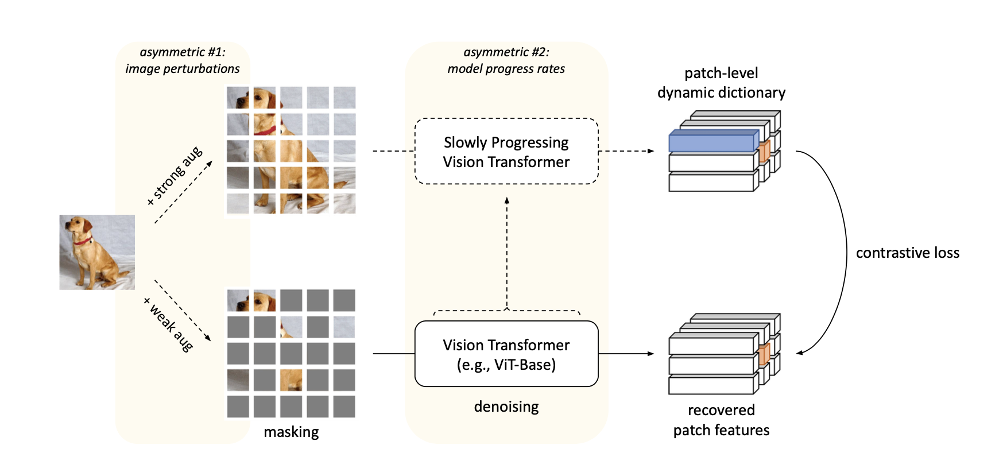
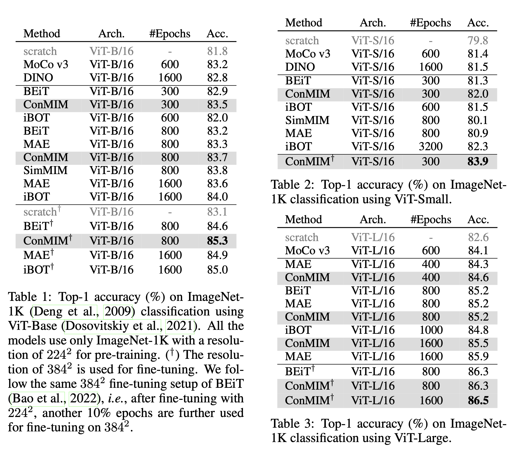
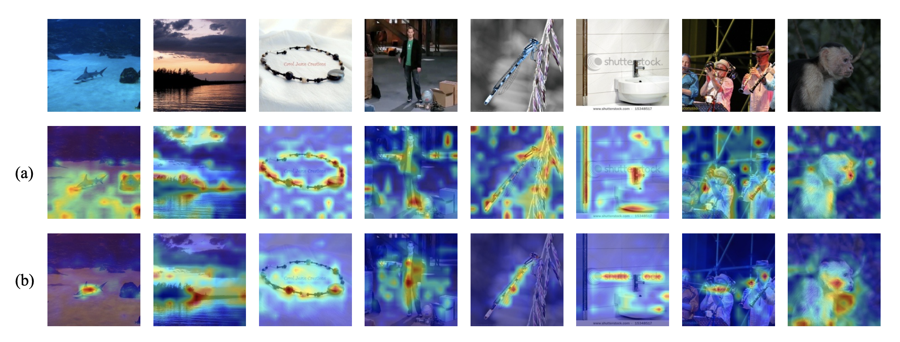

# [Masked Image Modeling with Denoising Contrast](https://arxiv.org/abs/2205.09616)

Official PyTorch implementation and pretrained models of "Masked Image Modeling with Denoising Contrast" in International Conference on Learning Representations (ICLR) 2023.

---




## Model Zoo
+ We provide the models **fine-tuned** on ImageNet1k. 

|   Arch   | Epochs | Resolution | Acc@1 | Fine-tuned model |
|:--------:|:------:|:----------:|:-----:| :---: |
| ViT-S/16 |  300   |  224x224   | 82.0  | [model](https://drive.google.com/file/d/1nI9IohDZ1KpBm4sUgLFyVoy6lHAu4LfF/view?usp=share_link) |
| ViT-B/16 |  800   |  224x224   | 83.7  | [model](https://drive.google.com/file/d/18MWukX2CZp_Eu6RiDVTIBzSt_0K996ri/view?usp=share_link) |
| ViT-L/16 |  800   |  224x224   | 85.2  | [model](https://drive.google.com/file/d/1adbm7ewm8uAEcdDklupGrrLAdoYeUDlN/view?usp=share_link) |
| ViT-L/16 |  1600  |  224x224   | 85.5  | [model](https://drive.google.com/file/d/1NXCA_oZ0mUiDbR3fFO8V8DixzZ4oRa-z/view?usp=share_link) |

## Results on ImageNet1K


## Visualization
Visualize the self-attention map between [CLS] token and local tokens of the pre-trained ViT-B/16 model on ImageNet-1K, where (a) indicates ConMIM pretraining and (b) indicates the vanilla instance-level contrastive pre-training. Self-attention maps out of 12 attention heads are averaged. It can be observed that ConMIM-pretrained models are much more locally discriminative and aware of the visual context.


## Setup
Clone the github repo and install the required packages.
```
git clone https://github.com/TencentARC/ConMIM.git
cd ./ConMIM
pip install -r requirements.txt
```
For mixed-precision training, please install [apex](https://github.com/NVIDIA/apex)

```
git clone https://github.com/NVIDIA/apex
cd apex
pip install -v --disable-pip-version-check --no-cache-dir --global-option="--cpp_ext" --global-option="--cuda_ext" ./
```
## Data Preparation
+ We use standard ImageNet-1K dataset (http://image-net.org/) for pre-training
+ Read from train and val list (download in this [link](https://drive.google.com/drive/folders/1Kmu3VHw1Ssqh6jwrWaUL1ihVx9KakKZv?usp=sharing)) to boost the speed of reading images from massive small files:
```
/dataset
└── imagenet1k
    ├── train
    ├── val
    ├── train_map.txt
    └── val_map.txt
```
+ `train_map.txt`,`val_map.txt` : which store the relative path in the corresponding zip file and ground truth label, and can be downloaded in this [link](https://drive.google.com/drive/folders/1Kmu3VHw1Ssqh6jwrWaUL1ihVx9KakKZv?usp=sharing).
## Pre-training on ImageNet-1K
+ We pre-train the ViT-L/16 model with 32 NVIDIA A100 GPUs on ImageNet-1K as follows:

```
OUTPUT_DIR="./output/conmim_pretrained"
DATA_PATH="./dataset/imagenet1k"
mkdir -p $OUTPUT_DIR

python -m torch.distributed.launch $@ run_conmim_pretraining.py \
        --data_path ${DATA_PATH} --output_dir ${OUTPUT_DIR} --mask_ratio 0.75 \
        --model conmim_large_patch16_224 \
        --batch_size 64 --lr 7.5e-4 --warmup_epochs 10 --epochs 1600 \
        --clip_grad 1.0 --drop_path 0 --layer_scale_init_value 1e-5 \
        --mask_type 'random_mps32' \
        --imagenet_default_mean_and_std \
        --save_ckpt_freq 20
```

## Fine-tuning on ImageNet-1K Classification
+ We finetune the pre-trained ViT-B/16 model with 8 NVIDIA A100/V100 GPUs as follows: 
```
CKP="./output/conmim_pretrained/checkpoint_copy-799.pth"
OUTPUT_DIR="./output/conmim_finetuned/"
DATA_PATH="/dataset/imagenet1k/"
mkdir -p $OUTPUT_DIR

python -m torch.distributed.launch --nproc_per_node=8 run_class_finetuning.py \
    --model beit_base_patch16_224 --data_path ${DATA_PATH}\
    --finetune ${CKP} \
    --output_dir ${OUTPUT_DIR} --batch_size 128 --lr 4e-3 --update_freq 1 \
    --warmup_epochs 20 --epochs 100 --layer_decay 0.65 --drop_path 0.1 \
    --weight_decay 0.05 --mixup 0.8 --cutmix 1.0 --nb_classes 1000 --enable_deepspeed \
    --imagenet_default_mean_and_std
```
## Fine-tuning on ADE20K Semantic Segmentation
We follow the [BEiT](https://github.com/microsoft/unilm/tree/master/beit) to complete our experiments

## Fine-tuning on COCO Detection and Segmentation
We follow the [MIMDet](https://github.com/hustvl/MIMDet) to complete our experiments

## Acknowledgement

This repository is built using the [BEiT](https://github.com/microsoft/unilm/tree/master/beit) repository, the [mc-BEiT](https://github.com/lixiaotong97/mc-BEiT) repository, the [timm](https://github.com/rwightman/pytorch-image-models) library, the [DeiT](https://github.com/facebookresearch/deit) repository, and the [MIMDet](https://github.com/hustvl/MIMDet) repository.

## Citation
If you find our work is useful for your research, please kindly cite our paper.
```
@article{yi2022masked,
  title={Masked image modeling with denoising contrast},
  author={Yi, Kun and Ge, Yixiao and Li, Xiaotong and Yang, Shusheng and Li, Dian and Wu, Jianping and Shan, Ying and Qie, Xiaohu},
  journal={International Conference on Learning Representations},
  year={2023}
}
```
## Contact
If you have any questions, you can contact me from the email: kunyi@tencent.com or laneyikun@foxmail.com
